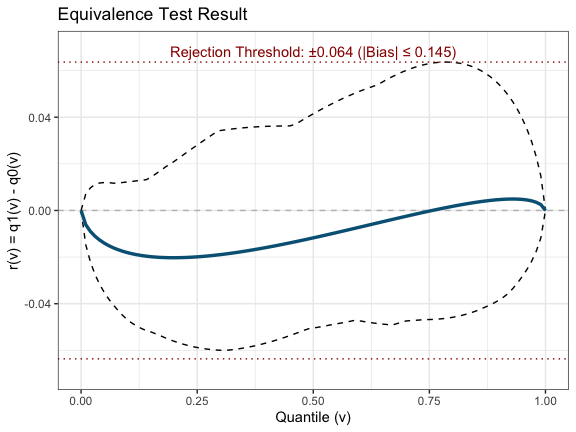

<!-- README.md is generated from README.Rmd. Please edit that file -->

# orddid

<!-- badges: start -->

[](https://github.com/soichiroy/orddid)
[](https://codecov.io/gh/soichiroy/orddid?branch=master)
[](https://github.com/soichiroy/orddid/actions)
<!-- badges: end -->

R package for difference-in-differences with ordinal outcomes (Yamauchi 2026+). 
- Author: [Soichiro Yamauchi](https://soichiroy.github.io/)
- Package manual:
  [PDF](https://soichiroy.github.io/files/packages/orddid_0_1_0.pdf)

## Installation

You can install the development version from
[GitHub](https://github.com/) with:

``` r
require("devtools")
install_github("soichiroy/orddid", dependencies = TRUE)
```

## Example: Parametric Estimation

The `gun_twowave` dataset contains a two-wave panel (2010 and 2012) from
the CCES, merged with mass-shooting treatment data from Barney and
Schaffner (2019). The outcome `guns` is a three-category ordinal measure
of attitudes toward gun control.

``` r
library(orddid)
library(dplyr)

data("gun_twowave")
```

The `ord_did()` function takes a data frame with column names for the
outcome, a post-period indicator, a treatment indicator, and a cluster
variable. Because treatment assignment is determined by whether a mass
shooting occurred nearby between 2010 and 2012, we construct a
time-invariant treatment indicator from the post-period observations.

``` r
## identify treated individuals (ever treated in post period)
treated_ids <- gun_twowave %>%
  filter(treat_100mi == 1) %>%
  distinct(caseid)

dat <- gun_twowave %>%
  mutate(
    post  = (year == 2012),
    treat = caseid %in% treated_ids$caseid,
    guns  = as.numeric(guns)
  )

## estimate effects
set.seed(1234)
fit <- ord_did(
  data    = dat,
  outcome = "guns",
  post    = "post",
  treat   = "treat",
  cluster = "reszip",
  n_boot  = 50
)

## category-specific effects
fit$estimate_effects
#> # A tibble: 3 × 4
#>   category   effect lower_ci upper_ci
#>      <int>    <dbl>    <dbl>    <dbl>
#> 1        1  0.00562 -0.00514  0.0227 
#> 2        2 -0.00993 -0.0328   0.00731
#> 3        3  0.00431 -0.00817  0.0212

## bounds on the relative treatment effect
fit$relative_effects
#> # A tibble: 1 × 5
#>   effect_lb effect_ub lower_ci upper_ci c_crit
#>       <dbl>     <dbl>    <dbl>    <dbl>  <dbl>
#> 1    -0.155     0.158   -0.172    0.177   1.64
```

## Example: Semiparametric Estimation with Covariates

The semiparametric estimator adjusts for covariates using an NPMLE-based
approach. The `gun_twowave_cov` dataset is a smaller subset of the panel
augmented with IRT ideology scores and demographics.

The first covariate should be continuous with positive Lebesgue density.
Here `ideology` (an IRT score) satisfies this requirement.

``` r
data("gun_twowave_cov")

treated_ids_cov <- gun_twowave_cov %>%
  filter(treat_100mi == 1) %>%
  distinct(caseid)

dat_cov <- gun_twowave_cov %>%
  mutate(
    post  = (year == 2012),
    treat = caseid %in% treated_ids_cov$caseid
  )

set.seed(1234)
fit_semi <- ord_did(
  data       = dat_cov,
  outcome    = "guns",
  post       = "post",
  treat      = "treat",
  cluster    = "reszip",
  n_boot     = 50,
  method     = "semiparametric",
  covariates = c("ideology", "ideology2", "female", "educ")
)

## category-specific effects
fit_semi$estimate_effects
#> # A tibble: 3 × 4
#>   category  effect lower_ci upper_ci
#>      <int>   <dbl>    <dbl>    <dbl>
#> 1        1 -0.0718 -0.104    -0.0400
#> 2        2  0.0199 -0.0254    0.0611
#> 3        3  0.0518  0.00830   0.0796

## bounds on the relative treatment effect
fit_semi$relative_effects
#> # A tibble: 1 × 5
#>   effect_lb effect_ub lower_ci upper_ci c_crit
#>       <dbl>     <dbl>    <dbl>    <dbl>  <dbl>
#> 1    -0.105     0.281   -0.154    0.332   1.64
```

## Example: Equivalence Test

When an additional pre-treatment period is available, the distributional
parallel trends assumption can be assessed using `run_equivalence()`.
The `gun_threewave` dataset contains a three-wave panel (2010, 2012,
2014). We use the 2010–2012 waves to test the assumption among
individuals who remain untreated through 2012.

``` r
data("gun_threewave")
gun_threewave <- na.omit(gun_threewave)

## keep individuals untreated through 2012
case_use <- gun_threewave %>%
  filter(year == 2012,
         pds_100mi == "Untreated in Previous Decade",
         t_100mi == 0) %>%
  pull(caseid)

## restrict to complete 2010-2012 cases
case10 <- gun_threewave %>%
  filter(caseid %in% case_use, year == 2010) %>% pull(caseid)
case12 <- gun_threewave %>%
  filter(caseid %in% case_use, year == 2012) %>% pull(caseid)
case_full <- intersect(case10, case12)

## individuals treated between 2012 and 2014
future_treated <- gun_threewave %>%
  filter(year == 2014, t_100mi == 1) %>%
  pull(caseid)

dat_eq <- gun_threewave %>%
  filter(caseid %in% case_full, year %in% c(2010, 2012)) %>%
  mutate(
    post  = (year == 2012),
    treat = caseid %in% future_treated,
    guns  = as.numeric(guns)
  )
```

``` r
set.seed(1234)
eq_result <- run_equivalence(
  data    = dat_eq,
  outcome = "guns",
  post    = "post",
  treat   = "treat",
  cluster = "reszip",
  n_boot  = 50
)

## worst-case bias inflation factor (1/M)
eq_result$inf_factor
#> [1] 1.135909

## plot the equivalence test result
plot_equivalence(eq_result)
```

<!-- -->

## References

Yamauchi, Soichiro (2026+). “[Difference-in-Differences for Ordinal Outcomes:
Application to the Effect of Mass Shootings on Attitudes toward Gun
Control](https://soichiroy.github.io/files/papers/did_ordinal_paper2.pdf).”
