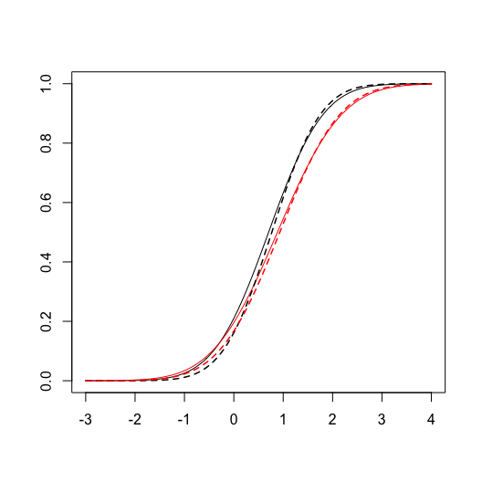

<!-- README.md is generated from README.Rmd. Please edit that file -->

# orddid

<!-- badges: start -->

<!-- badges: end -->

  - Author: [Soichiro Yamauchi](https://soichiroy.github.io/)

  - For a detailed description of the method see:
    
    Difference-in-Differences for Ordinal Outcome

## Installation Instructions

You can install the released version of orddid from
[CRAN](https://CRAN.R-project.org) with:

``` r
install.packages("orddid")
```

And the development version from [GitHub](https://github.com/) with:

``` r
require("devtools")
install_github("soichiroy/orddid", dependencies=TRUE)
```

## Example: Two Time Periods

This is a basic example which shows you how to solve a common problem:

``` r
## load package
library(orddid)
library(dplyr)
#> 
#> Attaching package: 'dplyr'
#> The following objects are masked from 'package:stats':
#> 
#>     filter, lag
#> The following objects are masked from 'package:base':
#> 
#>     intersect, setdiff, setequal, union

## load example data
data("gun_twowave")


## Estimate causal effects
set.seed(1234)
fit <- ord_did(
  Ynew = gun_twowave$guns12,
  Yold = gun_twowave$guns10,
  treat = gun_twowave$treat_100mi,
  cut = c(0, 1),
  n_boot = 500,
  pre = FALSE,
  verbose = FALSE
)

## view summary
summary(fit)
#> ── Effect Estimates ─────────────────────────────
#>              Effect      SE 90% Lower 90% Upper 95% Lower 95% Upper
#> Delta[2-3] -0.01385 0.00666  -0.02426  -0.00317  -0.02607  -0.00061
#> Delta[3]    0.00693 0.00822  -0.00572   0.02050  -0.00796   0.02285
```

## Example: Additional Pre-treatment Period is Available

``` r
## load data
data("gun_threewave")

## further subset to no-treated people through 2012
case_use <- gun_threewave %>%
  filter(year == 2012) %>%
  filter(pds_100mi == "Untreated in Previous Decade" & t_100mi == 0) %>%
  pull(caseid)
dat_14   <- gun_threewave %>% filter(caseid %in% case_use)

## check if subsetting is success full
## there should be no one treated until 2014
dat_14 %>% group_by(year, t_100mi) %>% summarize(n = n())
#> # A tibble: 4 x 3
#> # Groups:   year [3]
#>    year t_100mi     n
#>   <dbl>   <dbl> <int>
#> 1  2010       0  2823
#> 2  2012       0  2825
#> 3  2014       0  2152
#> 4  2014       1   667


## subset to comple-cases (exist from 2010 through 2014)
case14    <- dat_14 %>% filter(year == 2014) %>% pull(caseid)
case12    <- dat_14 %>% filter(year == 2012) %>% pull(caseid)
case10    <- dat_14 %>% filter(year == 2010) %>% pull(caseid)
case_full <- intersect(intersect(case14, case12), case10)

## treat Y2012 as "post" and Y2010 as "pre"
Ynew  <- dat_14 %>% filter(caseid %in% case_full & year == 2012) %>%
          pull(guns)
Yold  <- dat_14 %>% filter(caseid %in% case_full & year == 2010) %>%
          pull(guns)
treat <- dat_14 %>% filter(caseid %in% case_full & year == 2014) %>%
          pull(t_100mi)

## estimate parameters
fit <- ord_did(Ynew, Yold, treat, cut = c(0, 1),
               n_boot = 2000, pre = TRUE, verbose = FALSE)

## equivalence test
equiv_test <- equivalence_test(
  object = fit, alpha = 0.05
)

## view result
summary(equiv_test)
#> ── Equivalence Test ─────────────────────────────
#> Estimate (tmax)           Lower           Upper          pvalue 
#>         0.02199        -0.03986         0.02155         0.00151 
#> 
#> [1] H0 of no-equivalence is REJECTED with threshold 0.054

## plot result
plot(equiv_test, ylim = c(-0.1, 0.1), fill = FALSE)
```

<!-- -->

``` r

## test with different threshold
equiv_test2 <- equivalence_test(
  object = fit, alpha = 0.05, threshold = 0.01
)

## view result
summary(equiv_test2)
#> ── Equivalence Test ─────────────────────────────
#> Estimate (tmax)           Lower           Upper          pvalue 
#>          0.0220         -0.0399          0.0215          0.8677 
#> 
#> [1] H0 of no-equivalence is NOT REJECTED with threshold 0.01
```
